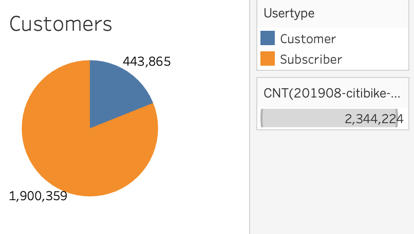
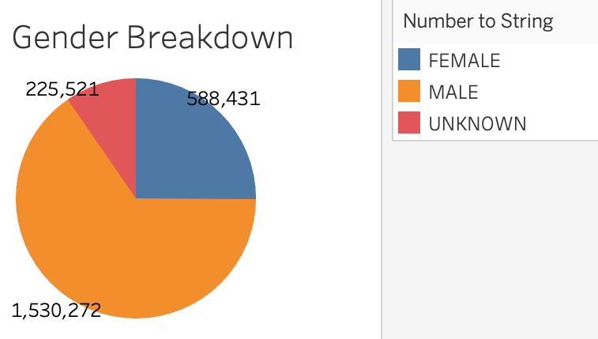
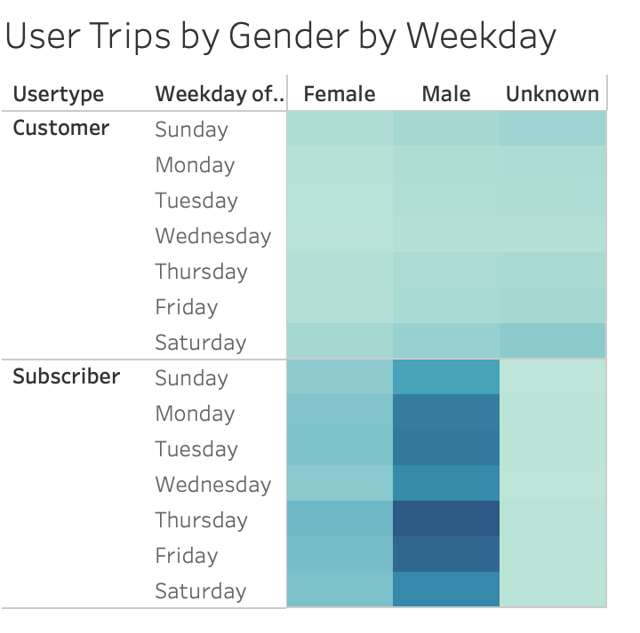
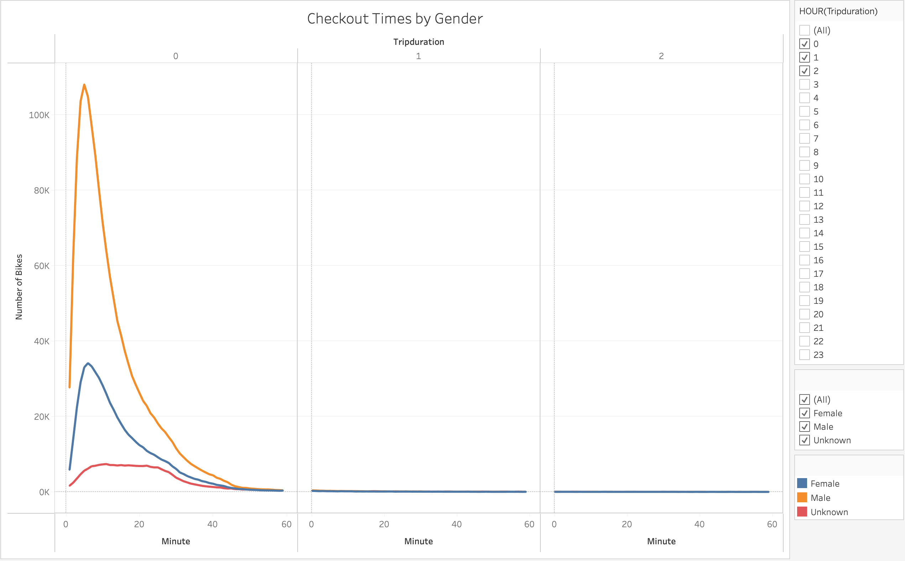
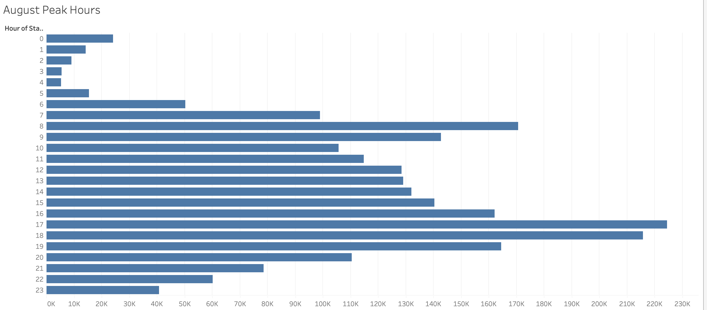
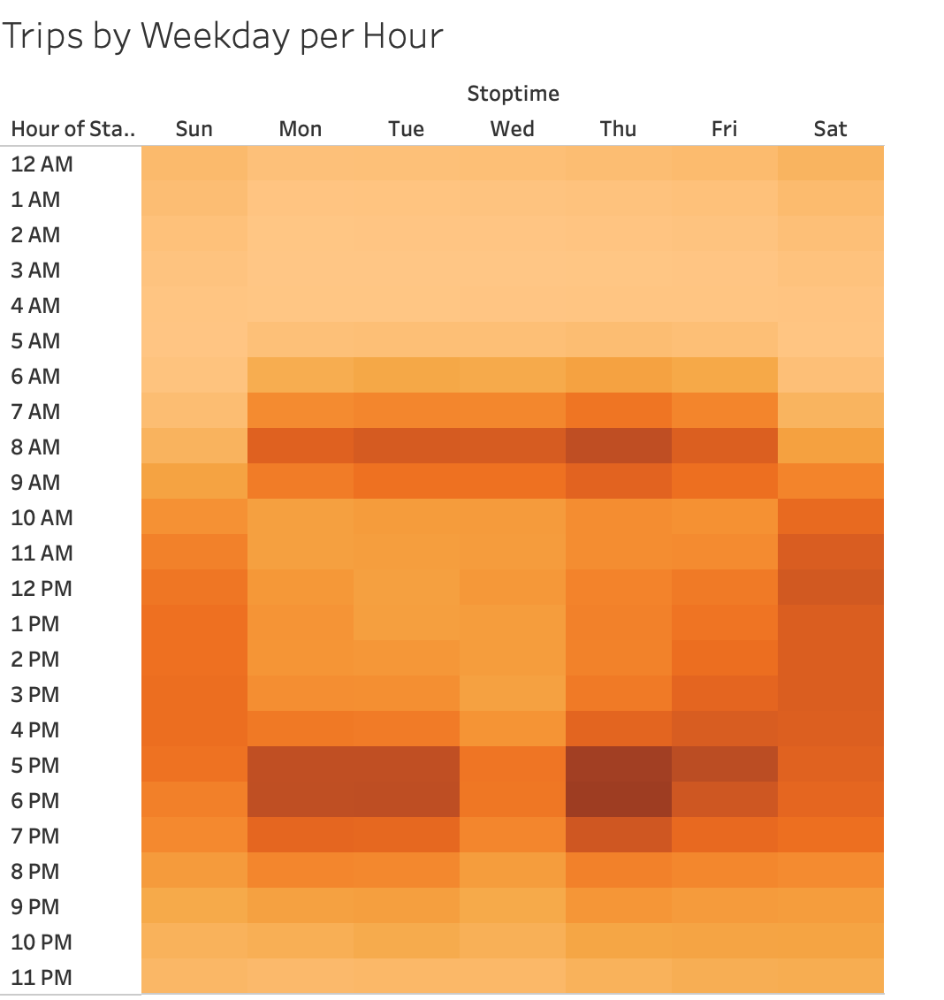
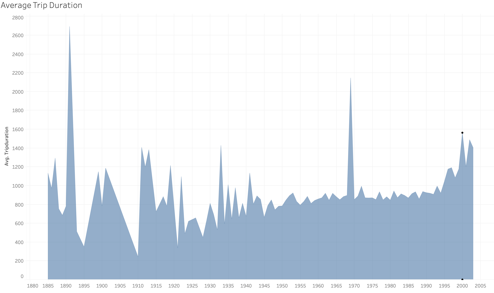
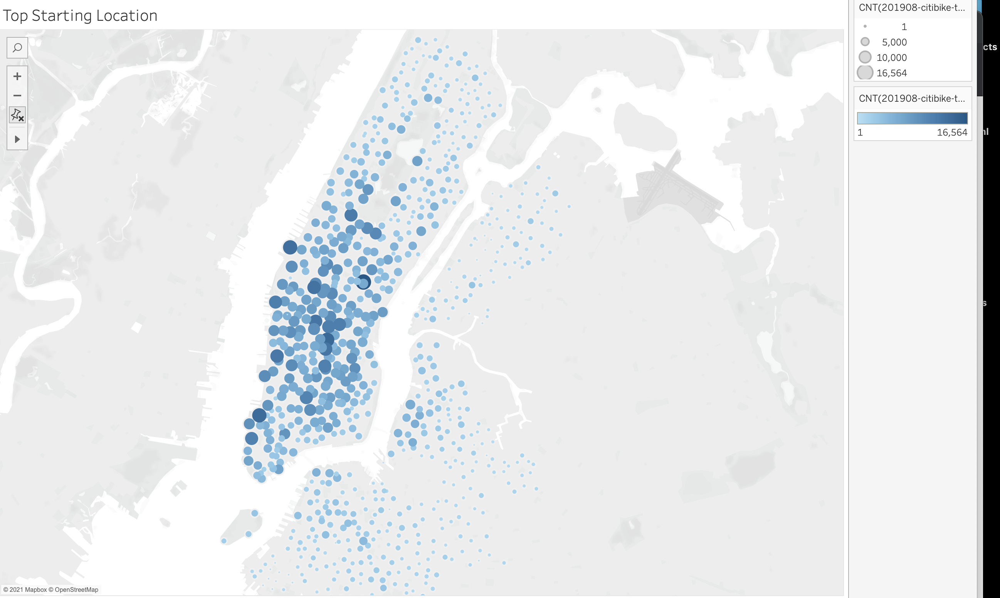
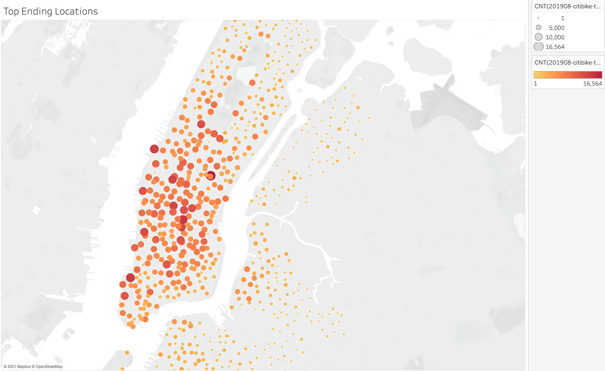

# Bikesharing

## Project Overview:

Citibike is a popular company that is very successful in many major cities, such as New York city. This analysis is centered around the idea of developing similar company and to see if it would be successful in Des Moines, IA. We collected data from Citibike, from August 2019 and used Tableau to analyze the data and present it in an efficient way. In order to breakdown the data, we had to organize it by trip duration, days, time, age, and even gender.

________

## Resources:
Data Sources: 201908-citibike-tripdata.csv, citibike_df.csv, /Resource/..

Software: Tableau Public, Jupyter Notebook, Visual Studio Code

______

## Results:

### We started by checking the total number of Customer/Subscribers.

### Next we sort it by gender

## Then we sort user by gender by weekday

### Finding ride duration by gender

### Now we see the peak hours for August

### Finding Trips by weekday per hour

### Then we find the trip duration based on age

## Summery:

From our data, we can see: 
* The majority of people are active subscribers compared to regular customers
* The majority of customer/subscribers are male
* Peak times are Thursdays between 5pm and 7pm
* Older people have shorter ride times

In conclusion, citibikes are highly popular in big cities amongst commuters, and would say widely successful. This could easily be adapted to any major city. For future analysis, we should see the starting and stopping points of the most popular location to find similar locations in other potential cities.

## Starting Points

## Stopping Points

Tableau Story

[Link to Story](https://public.tableau.com/app/profile/justin.livingston/viz/bikesharingmodule14/CitibikeStory)

[Link to Dashboard](https://public.tableau.com/profile/justin.livingston#!/)

